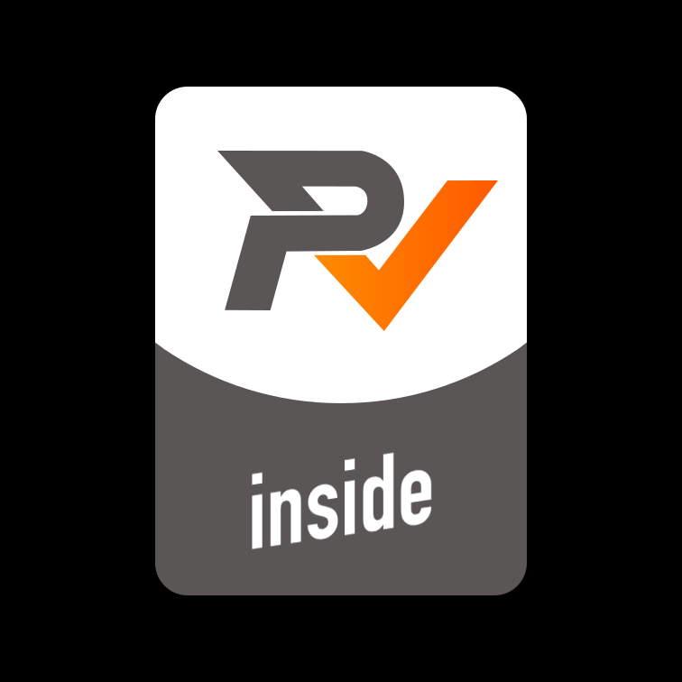

# rm_vision

**如果此开源项目所改进的内容对贵战队有帮助请Star本项目，若有使用本项目的能量机关模块或借鉴思路后的实车击打效果，希望能将视频发一份给作者本人（qq：1042277145），这对作者有非常大的帮助，十分感谢！**


## Overview

rm_vision 项目旨在为 RoboMaster 队伍提供一个规范、易用、鲁棒、高性能的视觉框架方案，为 RM 开源生态的建设添砖加瓦

如果本开源项目对于贵战队的视觉技术发展起到了实质性的帮助作用，请在机器人上贴上以下标签以助力该项目的推广，十分感激！

[](docs/rm_vision_inside.svg)

[](https://opensource.org/licenses/MIT)

Origin Author: Chen Jun

Develop Author: Zheng Yu

[](https://github.com/FaterYU/rm_vision/actions/workflows/ci.yml)

## 新增特性及可能的后续优化方向

- [ ] [rm_vision] 使用 LifeCycle 管理节点
- [x] [armor] 识别器灯条识别由旋转外接矩形更换为最小二乘法
- [x] [armor] 识别器调试话题加入角点信息，供后续数据录制使用
- [x] [armor] 识别器灯条增加外接矩形中二值化占比过滤条件，减少将大块白光识别为灯条所占用资源
- [x] [armor] 识别器增加任务触发条件，适配能量机关等多任务切换
- [x] [armor] 跟踪器增加视野内多目标间切换功能
- [x] [armor] 跟踪器扩展卡尔曼滤波过程噪声矩阵中增加平移与旋转参数负相关关系
- [x] [armor] 可视化适配 Foxglove 新版本
- [x] [armor] 控制端选板及开火控制逻辑
- [ ] [armor] 跟踪器扩展卡尔曼滤波运动模型由匀速模型改为匀加速模型
- [ ] [armor] 识别器角点PNP结合激光测距传感器自动调参
- [ ] [armor] 处理装甲板的灯条边缘受装甲板物理结构遮挡问题
- [ ] [armor] 预测效果评价器
- [x] [serial] 通信适配能量机关
- [x] [serial] 通信适配自瞄切换目标
- [x] [serial] 通信新增控制端时间戳（计算通信与运算延时）
- [x] [buff] 新增能量机关自动瞄准算法模块
- [ ] [buff] 优化能量机关扇叶神经网络识别角点效果（准确率、帧率）
- [ ] [buff] 优化跟踪器在大能量机关任务下的状态机逻辑
- [ ] [buff] 控制端开火控制
- [x] [record] 新增自动录包模块
- [ ] [record] 与相机节点使用同一进程
- [ ] [record] 控制端新增物理按键启停录制

## 包含项目

[changed] 装甲板自动瞄准算法模块 https://github.com/FaterYU/rm_auto_aim

[new] 能量机关自动瞄准算法模块 https://github.com/FaterYU/rm_buff

~~MindVision 相机模块 https://github.com/FaterYU/ros2_mindvision_camera~~

HikVision 相机模块 https://github.com/FaterYU/ros2_hik_camera

机器人云台描述文件 https://github.com/FaterYU/rm_gimbal_description

[changed] 串口通讯模块 https://github.com/FaterYU/rm_serial_driver

~~视觉算法仿真器 https://github.com/FaterYU/rm_vision_simulator~~

[new] 自动录包模块 https://github.com/FaterYU/rm_auto_record

## 通过 Docker 部署

拉取镜像

```
docker pull ghcr.io/fateryu/rm_vision:latest
```

构建开发容器

```
docker run -it --name rv_devel \
--privileged --network host \
-v /dev:/dev -v $HOME/.ros:/root/.ros -v ws:/ros_ws \
ghcr.io/fateryu/rm_vision:latest \
ros2 launch foxglove_bridge foxglove_bridge_launch.xml
```

构建运行容器

```
docker run -it --name rv_runtime \
--privileged --network host --restart always \
-v /dev:/dev -v $HOME/.ros:/root/.ros -v ws:/ros_ws \
ghcr.io/fateryu/rm_vision:latest \
ros2 launch rm_vision_bringup vision_bringup.launch.py
```

## 源码编译

TBD
